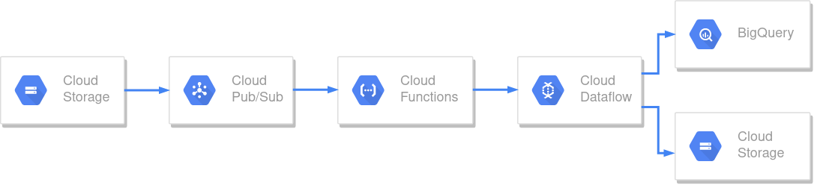

# gcs-to-bq-pipeline

A solid data pipeline for batch processing files uploaded to Google Cloud Storage using Google Cloud Dataflow.

## Authors

 1. Luis Cristóbal López García

## Diagram

The following diagram shows all the services needed for the solution.



- **Cloud Storage:** source where the files to be processed will be uploaded.
- **Cloud Pub/Sub:** notification system which will publish a message whenever a file is uploaded to our bucket.
- **Cloud Functions:** serverless service used for starting the Dataflow job from its template.
- **Cloud Dataflow:** serverless unified stream and batch data processing.
- **BigQuery:** DataWarehouse acting as a sink for our pipeline.

## Deployment

We will use CloudShell to deploy each service. You will need to clone the repository and run the commands from the project root directory. If you prefer it, you can deploy the project using the Google Cloud Console, although no instructions are provided for this process.

### Clone the repository and move to it

```
git clone https://github.com/Luiscri/gcs-to-bq-pipeline
cd gcs-to-bq-pipeline/
```

### Edit and set ENV variables

Open the `.env` file contained on the project root directory with your preferred editor and change, at least, the `PROJECT_ID` and the three bucket names variables. Also, feel free to change the locations to the ones that best suit your needs.

```
PROJECT_ID=myproject
DATASET_NAME=mydataset
TABLE_NAME=stats
TEMPLATE_NAME=pipeline_template
BUCKET=gcs-to-dataflow
DATAFLOW_BUCKET=dataflow-files
GCF_BUCKET=gcf-files
REGION=europe-west1
MULTI_REGION=EU
```

Once you have applied and saved the changes, set them to your Cloud Shell session.

```
source .env
```

**Note:** these ENV variables will not persist among sessions.

### Activate service API's

In this step we will activate all the API's involved in the project.

```
gcloud services enable storage.googleapis.com
gcloud services enable pubsub.googleapis.com
gcloud services enable cloudfunctions.googleapis.com
gcloud services enable cloudbuild.googleapis.com
gcloud services enable dataflow.googleapis.com
gcloud services enable bigquery.googleapis.com
```

### Create the buckets

We will need three buckets, one acting as Data Lake where the files will be uploaded and retrieved, and another two where the Dataflow and Cloud Functions services will save its staging and temp files.

```
gsutil mb -p $PROJECT_ID -l $MULTI_REGION gs://$BUCKET
gsutil mb -p $PROJECT_ID -l $MULTI_REGION gs://$DATAFLOW_BUCKET
gsutil mb -p $PROJECT_ID -l $MULTI_REGION gs://$GCF_BUCKET
```

### Create the PubSub topic and notification

First, we will create a new topic:

```
gcloud pubsub topics create new-files
```

Then, we need to create the notification for new files creation on our bucket:

```
gsutil notification create -t new-files -f json -e OBJECT_FINALIZE gs://$BUCKET
```

The subscription will be created automatically when we deploy our Cloud Function on the next step.

### Deploy the Cloud Function

Now we can deploy our function. Feel free the have a look at `gcf/` directory to gain insight about what the code is doing.

```
gcloud functions deploy pubsub-to-dataflow --runtime python37 --trigger-topic new-files --region $REGION \
--source gcf/ --entry-point start_job --ingress-settings internal-only --stage-bucket gs://$GCF_BUCKET \
--set-env-vars PROJECT_ID=$PROJECT_ID,REGION=$REGION,DATAFLOW_BUCKET=$DATAFLOW_BUCKET,TEMPLATE_NAME=$TEMPLATE_NAME
```

### Install Apache Beam

In order to create our pipeline template, we will first need to install Apache Beam on the Cloud Shell. It is a good idea to use a `venv` instead.

```
python3 -m venv beam
source beam/bin/activate
python3 -m pip install --upgrade pip
pip3 install apache-beam
pip3 install apache-beam[gcp]
```

### Create the Dataflow template

If you do not want to pass all these arguments when creating the template, you can edit the options default values defined at `dataflow/pipeline_template.py`.

```
cd dataflow/
python3 -m pipeline_template --project $PROJECT_ID --region $REGION \
--template_location gs://$DATAFLOW_BUCKET/templates/$TEMPLATE_NAME \
--dataflow_bucket $DATAFLOW_BUCKET --bq_sink ${PROJECT_ID}:${DATASET_NAME}.${TABLE_NAME}
```

Last two arguments are custom defined. You can gain insight about them by checking the pipeline code.

Finally, we need to copy the metadata file to the same directory where we created our template.

```
gsutil cp pipeline_template_metadata gs://$DATAFLOW_BUCKET/templates/
```

### Create a BigQuery dataset

Although the table is created once the pipeline runs, we first need to create a dataset to contain it.

```
bq --location $MULTI_REGION mk --dataset $PROJECT_ID:$DATASET_NAME
```

## Usage

Once we have deployed and created all the necessary services, we can start the process. Whenever a file is uploaded to our bucket `gs://$BUCKET/raw/` path, a Dataflow job will be created and will process the file. This file needs to have an specific structure, since the ETL process has been designed for it.

You can download the file from [this](https://www.kaggle.com/shubhamchambhare/pokemons-and-there-stats) Kaggle dataset url. There are two files; you can use both of them, but the one we have used is `pokemon.csv`.

Now, navigate to your Cloud Storage browser, select your bucket and create a `raw/` folder in it. If you drag and drop the file you have just downloaded, the data pipeline will start. Note that it may take 4-5 minutes to your Dataflow job to end. When finished, go to the BigQuery console and check that a table with the processed data has been created. Also, a file (or files, depending on the number of sharps considered by Apache Beam) containing a timestamp prefix has been created on your bucket `processed/` path in case you want a copy of the processed data. 

## License

Copyright © 2021

Licensed under the Apache License, Version 2.0 (the "License"); you may not use this file except in compliance with the License. You may obtain a copy of the License at:

```
http://www.apache.org/licenses/LICENSE-2.0
```

Unless required by applicable law or agreed to in writing, software distributed under the License is distributed on an "AS IS" BASIS, WITHOUT WARRANTIES OR CONDITIONS OF ANY KIND, either express or implied. See the License for the specific language governing permissions and limitations under the License.